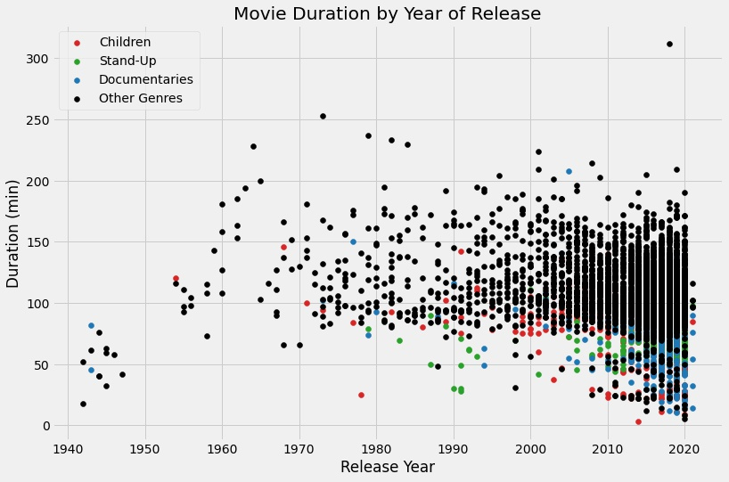

# Investigating Netflix Movies and Guest Stars in The Office

This project is to gain experience in an essential data science skill - exploratory data analysis. This consists of critical tasks such as manipulating raw data and drawing conclusions from plots you create of the data.

Netflix! What started in 1997 as a DVD rental service has since exploded into the largest entertainment/media company by  [market capitalization](https://www.marketwatch.com/story/netflix-shares-close-up-8-for-yet-another-record-high-2020-07-10), boasting over 200 million subscribers as of  [January 2021](https://www.cbsnews.com/news/netflix-tops-200-million-subscribers-but-faces-growing-challenge-from-disney-plus/).

Given the large number of movies and series available on the platform at a CSV file, it looks like **there is something to the idea that movie lengths have decreased over the past ten years**! There are a few questions about this trend that we are currently unable to answer, including:
1.  What does this trend look like over a longer period of time?
2.  Is this explainable by something like the genre of entertainment?

Python skills needed for this project are:
- Filter on DataFrame  (rows & columns).
- Visualizing data over a range of time by using pyplot.

The project is in the Python notebook at [notebook](notebook.ipynb).